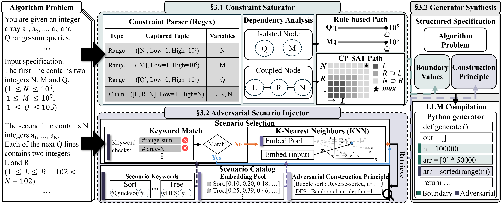

# STAB: Specification-driven Testing for Algorithmic Bottlenecks

<p align="center">
  <a href="https://github.com/suhanmen/STAB/stargazers">
    
  </a>
  <a href="https://github.com/suhanmen/STAB/commits/main">
    
  </a>
  <a href="https://github.com/suhanmen/STAB/graphs/contributors">
    
  </a>
</p>

<div align="center">
    <a href="https://arxiv.org/abs/<arxiv-id>"><b>Paper Link</b>📖</a>
</div><br>


## 📰 News
- 📢 NEW! The official **STAB** pipeline has been released on GitHub. (May 27, 2026)


## 🔍 Motivation
Functional correctness alone is not enough for algorithmic code. A solution that passes every test in a benchmark suite may still be a **suboptimal algorithm** that only escapes detection because the suite does not stress its worst case. **STAB** asks a sharper question: *“Does this test case actually expose the algorithm's bottleneck?”* — and generates inputs that push correct-but-suboptimal implementations over their time limit using **only the natural-language problem specification**, without ever reading the solution code.

## ✨ About STAB
<p align="center">
  
</p>


**STAB** (**S**pecification-driven **T**esting for **A**lgorithmic **B**ottlenecks) is a pipeline for generating *efficiency* test cases that expose algorithmic bottlenecks in solutions to competitive-programming problems, taking only a natural-language problem specification as input.

Existing efficiency-test methods either scale up input size blindly (**EvalPerf**) or search for slow paths against a *specific* reference implementation (**WEDGE**); both inherit implementation-specific execution behavior. STAB instead targets the *problem* by decomposing efficiency-test generation into two independent sources of pressure — **constraint-bound size maximization** and **adversarial structure injection** — and recombining them into a structured generation specification that an LLM compiles into a self-contained Python generator function.

The figure above illustrates STAB's three-stage pipeline: **Constraint Saturator → Adversarial Scenario Injector → Generator Synthesis**.


## 🚀 What makes STAB valuable?
✅ **Constraint-aware boundary resolution** — Naively saturating each variable to its upper bound ignores cross-variable dependencies (product bounds, chained inequalities, Σ-over-test-cases) and produces *invalid* inputs. STAB combines **regex-based constraint extraction**, a **variable dependency graph**, **rule-based saturation** of independent variables, and **CP-SAT optimization** of coupled variable groups to systematically compute the largest *valid* size assignment a specification admits.

✅ **Scenario-guided adversarial construction** — Instead of profiling a reference implementation to find what slows it down, STAB makes the *problem's* latent algorithmic structure explicit through a curated **scenario catalog**: **13 scenarios / 51 implementations**, each annotated with a **vulnerability class** (Structural / Numerical / Size-only) and an **adversarial construction principle** (e.g., reverse-sorted arrays for pivot-sensitive quicksort, bamboo trees for recursive traversal, dense graphs for shortest-path). Retrieval over this catalog — keyword match ∪ per-scenario centroid KNN — gives the LLM a direct answer to *"what structure makes this problem slow."*

✅ **Reference-free efficiency testing** — Unlike prior methods (EvalPerf, WEDGE) that require a reference implementation to profile, STAB operates from the natural-language specification alone. Despite this stricter input, STAB **exceeds both prior methods in every model–language combination** on CodeContests, evidence that the strongest signal for efficiency test generation comes from the *problem's algorithmic structure*, not from the slow paths of any one implementation.


## 📈 Results

**Main result — Algorithmic Slowdown Rate (ASR) on CodeContests**, averaged over five accepted reference solutions per problem (fastest, slowest, and three random) across Python, Java, and C++.

| Model          | Method | ASR_Python (↑) | ASR_Java (↑) | ASR_C++ (↑) | Avg. (↑)     |
| :------------- | :----- | :------------: | :----------: | :---------: | :----------: |
| **Qwen-3.5**   | Base   |     53.54%     |    52.51%    |    56.00%   |    54.02%    |
|                | STAB   |   **70.80%**   |  **73.36%**  |  **69.05%** |  **71.07%**  |
| **Gemma-4**    | Base   |     46.69%     |    44.58%    |    49.21%   |    46.83%    |
|                | STAB   |   **75.75%**   |  **78.84%**  |  **72.86%** |  **75.82%**  |
| **Gemini-3.1** | Base   |     50.76%     |    54.75%    |    40.95%   |    48.82%    |
|                | STAB   |   **73.68%**   |  **75.44%**  |  **69.48%** |  **72.87%**  |
| **GPT-5.4**    | Base   |     64.85%     |    70.65%    |    62.71%   |    66.07%    |
|                | STAB   |   **70.88%**   |  **73.12%**  |  **68.48%** |  **70.83%**  |

**STAB vs. prior efficiency-test methods** (averaged over 5 accepted solutions per problem).

| Model          | Method   | ASR_Python (↑) | ASR_Java (↑) | ASR_C++ (↑) |
| :------------- | :------- | :------------: | :----------: | :---------: |
| **Gemini-3.1** | EvalPerf |     28.91%     |    31.89%    |    23.21%   |
|                | WEDGE    |     35.79%     |    41.09%    |    38.92%   |
|                | STAB     |   **73.68%**   |  **75.44%**  |  **69.48%** |
| **GPT-5.4**    | EvalPerf |     45.35%     |    47.84%    |    42.06%   |
|                | WEDGE    |     29.00%     |    36.18%    |    37.81%   |
|                | STAB     |   **70.88%**   |  **73.12%**  |  **68.48%** |

**Per-module ablation** (ASR averaged over five accepted solutions).

| Model          | Variant        | ASR Python (↑) | ASR Java (↑) | ASR C++ (↑) |
| :------------- | :------------- | :------------: | :----------: | :---------: |
| **Gemini-3.1** | STAB           |   **73.68%**   |  **75.44%**  |  **69.48%** |
|                | – M1           |     70.32%     |    73.67%    |    66.47%   |
|                | – M2           |     72.37%     |    75.40%    |    67.17%   |
|                | – M1, M2       |     50.76%     |    54.75%    |    40.95%   |
| **GPT-5.4**    | STAB           |   **70.88%**   |  **73.12%**  |  **68.48%** |
|                | – M1           |     64.15%     |    68.45%    |    61.51%   |
|                | – M2           |     66.45%     |    70.19%    |    64.07%   |
|                | – M1, M2       |     64.85%     |    70.64%    |    62.71%   |

Our experiments across 4 LLMs (Qwen-3.5, Gemma-4, Gemini-3.1, GPT-5.4) on CodeContests reveal:

* **Consistent improvement over Base prompting.** STAB raises ASR for every LLM evaluated, lifting the model-averaged ASR from **53.94% → 72.65%**, with relative gains of **+31.6% (Qwen-3.5), +61.9% (Gemma-4), +49.3% (Gemini-3.1), and +7.2% (GPT-5.4)**. STAB exceeds Base in **every Python / Java / C++ cell** of the main result table.

* **Specification beats reference profiling for worst-case structure.** Despite using *only* the problem specification, STAB exceeds both EvalPerf and WEDGE in every model–language combination — a relative gain of **+96.6% over EvalPerf** and **+97.0% over WEDGE** averaged across the two evaluated LLMs and three languages.

* **Each module contributes independently.** Removing either the constraint saturator (M1) or the adversarial scenario injector (M2) lowers ASR for every model–language pair. Keeping only M1 outperforms keeping only M2, indicating that boundary resolution is the more immediate prerequisite — but the full pipeline still exceeds both single-module variants, confirming that adversarial constructions add real lift on top of a resolved boundary.


For per-strategy breakdowns, the full 13-scenario catalog with 51 implementations, and case studies, see the paper.


## 🛠️ Setup
### Datasets
STAB is evaluated end-to-end on **CodeContests** (`deepmind/code_contests` on the HuggingFace Hub). The pipeline reads from the dataset directly — no manual dataset preparation is required.

* **`test` split** and **`valid` split** are used for runtime evaluation.
* The `train` split is reserved **only** for the KNN anchor pool in the adversarial scenario injector. The anchor pool is built from problem specifications and does **not** use solutions, generated tests, runtime measurements, or evaluation outcomes.
* For each problem and language, **five representative accepted solutions** are selected (the fastest, the slowest, and three randomly sampled) by pre-running every accepted solution on the CodeContests test suite and ranking by mean execution time.


### Environment

The pipeline targets Python 3.10 and uses HuggingFace `datasets`, and DOMjudge for execution-based timing.
A local DOMjudge instance is required for evaluation. See `domjudge/domjudge_server_start.sh` for the containerized setup (MariaDB on port 50001, domserver on 50002, plus parallel judgehosts on 50043–50046).

## ⚡ Quickstart
The following scripts run STAB end-to-end on CodeContests:

### **Step 1: Clone the Repository**
```shell
git clone https://github.com/suhanmen/STAB.git
cd STAB
```

### **Step 2: Set up the environment**
```shell
conda env create --file setting/environment.yaml
conda activate STAB
```

### **Step 3: Start the DOMjudge auto-judge**
```shell
cd domjudge
sh domjudge_server_start.sh all     # MariaDB + domserver + judgehosts
sh domjudge_server_start.sh status  # verify
cd ..
```

### **Step 4: Generate efficiency test cases**

**(1) Extract problem features** *(one-time)*
```shell
sh scripts/description_feature_extractor.sh
```
Extracts structured natural-language fields from each CodeContests problem into `dataset/codecontests_description_separated/features_{split}.json` (consumed by M1 and M2 downstream).

**(2) Build the scenario anchor pool** *(one-time)*

The adversarial scenario injector uses a KNN index over CodeContests `train` split problem embeddings (`SFR-Embedding-2_R`, 4096-dim). Build the pool once:
```shell
python code/utils/build_kw_anchor_meta.py --splits train
python code/utils/build_train_anchors.py   --kw_all
```

**(3) Run the generator**
```shell
sh scripts/slow_tc_generator.sh
```
Output: per-problem JSON files at `output/codecontests/our_method/<split>/All_USE/slow_testcase_refinement_prompt/<model>/`. Configuration (split, LLM, mode, number of generators per problem, retry budget, refinement-prompt version, etc.) is set via the variables at the top of `scripts/slow_tc_generator.sh`.


### **Step 5: Evaluate (ASR)**
```shell
sh scripts/slow_tc_evaluation.sh
```
Judges each generated test against the five accepted reference solutions (fastest, slowest, three random) via DOMjudge and computes **ASR** — the fraction that exceeds each solution's CodeContests max runtime (plus LEF, constraint compliance, and TC correctness as secondary metrics).

Output: per-strategy summaries at `evaluation/codecontests/our_method/<split>/All_USE/slow_testcase_refinement_prompt/<model>/`.

Each script supports detailed configuration via the variables at the top of the corresponding shell file (split, LLM, mode, number of generators per problem, retry budget, refinement-prompt version, etc.).


## 🔖 Citation
```bibtex
@misc{lim2026stab,
  title         = {STAB: Specification-driven Testing for Algorithmic Bottlenecks},
  author        = {Soohan Lim and Joonghyuk Hahn and Hyundong Jin and Yo-Sub Han},
  year          = {2026}
}
```
